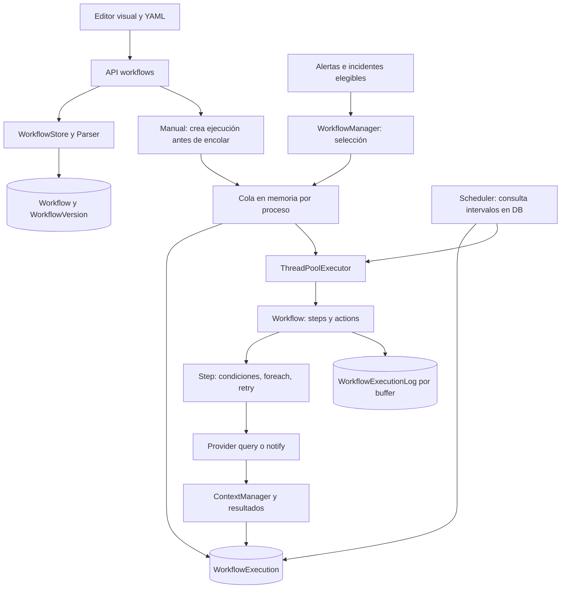

# Arquitectura de Workflows & Automation

KEEP-LAB-13 · baseline Keep e255d6a2fb7443d0c4cadc871868897f86dc6a95. Arquitectura SOURCE_CONFIRMED; control de flujo seleccionado UNIT_ASSISTED. El certificado es de conocimiento acotado, no de operación en producción.

El motor combina un parser YAML, Workflow/Step, ContextManager, un manager de triggers, un scheduler con ThreadPoolExecutor y persistencia SQL. No es un DAG distribuido: Workflow recorre primero steps y luego actions; foreach introduce iteración dentro de un Step. El frontend permite edición visual y YAML, ejecución manual, pruebas, versiones y logs. Los hooks UI desembocan en /workflows; la API usa WorkflowStore/Parser y DB, y el trabajo se ejecuta posteriormente (S01–S09, S14–S18).

S02:287–596 filtra y encola alertas. Analiza una instancia por workflow para evaluar triggers y vuelve a parsear una instancia por ejecución para separar contextos; los DTO de evento pueden compartirse entre entradas de cola. La implementación Redis de este manager está comentada. S03:79–113 y 408–414 mantienen una lista local y la vacían bajo Lock antes de despachar. La DB contiene ejecuciones, pero no sustituye la lista como cola durable: una alerta aún no despachada puede no tener fila; una solicitud manual sí tiene fila in_progress antes del enqueue. Persistencia de ejecución no implica entrega durable.

El scheduler arranca en lifespan API si SCHEDULER está activo (S12), y también desde el worker ARQ (S13). Su ciclo consulta intervalos y eventos y duerme un segundo; cada 100 ciclos comprueba vencimientos. KEEP_MAX_WORKFLOW_WORKERS controla el pool (default 20); el loop ocupa un future en ese pool. Son defaults de código, no configuración runtime observada.

Cada ejecución enlaza tenant/workflow/revision y resultados/logs. El transporte a proveedores puede tener side effects antes de persistir resultados o estado final. No se observa una transacción que abarque cola, HTTP y DB. No se certifica exactly-once, cancelación efectiva, aislamiento entre procesos ni recuperación tras un crash.

Reutilización: LAB09 conserva identidad y dedup; LAB10 prueba orden de llamadas de cola respecto de CEL, con cero workflows ejecutables en aquel ensayo; LAB11 certifica cuatro contratos con mocks y Step/IOHandler/ContextManager; LAB12 y 12.MW conservan sus límites de enrichment y maintenance. Nada de ello certifica un workflow E2E nuevo.
