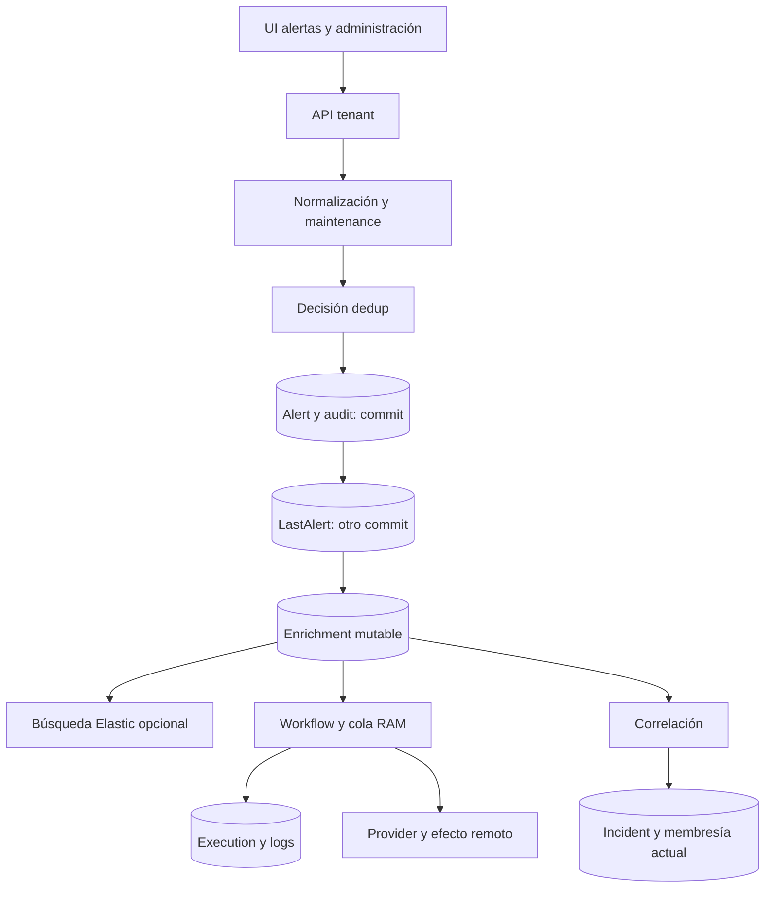

# Data & Persistence — arquitectura consolidada

Keep HEAD e255d6a2fb7443d0c4cadc871868897f86dc6a95. Conocimiento nuevo SOURCE_CONFIRMED + OBSERVED_READ_ONLY_SCHEMA + UNIT_ASSISTED. Runtime LAB08/09/10 solo reutilizado con sus límites.

SQLModel/SQLAlchemy define un núcleo relacional tenant; Alembic mantiene el esquema. S01:139–187 selecciona Cloud SQL/MySQL, connection string o SQLite de fallback `./keep.db`; el laboratorio previo y la metadata actual corresponden a `keep/state/db.sqlite3`, no al fallback. No se leyeron variables secretas de runtime. S02:171–189 migra a head salvo SKIP_DB_CREATION exactamente true; S03 configura render_as_batch. No se importó Keep ni se ejecutó su startup.

Ocurrencia, identidad lógica, versión semántica y proyección actual son objetos diferentes. AlertRaw es captura opcional; Alert contiene JSON/versiones; LastAlert tiene PK tenant/fingerprint y apunta a una Alert. AlertDeduplicationEvent guarda decisión pero carece de fingerprint, event_id y revisión inmutable de política. AlertAudit y AlertEnrichment complementan el estado, no forman un ledger completo e inmutable.

La asociación operacional es LastAlertToIncident → LastAlert → Alert actual. No conserva por sí sola la versión que se vio al incorporar el miembro; AlertToIncident existe pero LAB10 no la usó. Incident agrega estado/timestamps/cache/procedencia; Rule es mutable y su soft delete no equivale a borrado físico CASCADE.

WorkflowVersion separa definición de ejecución; WorkflowExecution registra revisión como número y relación ORM viewonly, sin FK compuesto hacia WorkflowVersion. Logs y enlaces de ejecución son registros separados. Provider es configuración referenciada por configuration_key; el backend Secret es otro almacenamiento. Maintenance es definición mutable de una ventana, sin revisión inmutable.

Persistencia relacional, búsqueda e invocación remota son límites diferentes. S11 confirma commits antes de LastAlert, enrichment, indexing y dispatch. Una recepción no constituye una transacción atómica que abarque todos esos efectos. S12 indexa búsqueda; fallos de indexing se capturan en S11. La cola RAM de workflows sigue siendo la caracterizada por LAB13.

Diagrama conceptual basado en fuente y evidencia previa; no captura de un E2E nuevo. FULL y drop maintenance tienen las excepciones documentadas por LAB09/12.MW, y no recorren todas las cajas.
